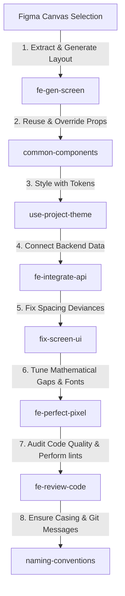

# Agent Skills Directory

Welcome! This workspace contains a cohort of **8 developer skills** located in `.agents/skills/` to guide code generation, visual alignment, API integration, and code quality. 

Before starting work, read this directory to identify the appropriate skill files for your task.

---

## Skills Index

### 1. [use-project-theme](./use-project-theme/SKILL.md)
* **Purpose**: Core styling and visual tokens guide.
* **Key Topics**:
  - Figma-derived color palette classes (`bg-primary-1`, `text-neutral-3`).
  - Preconfigured shadows and effects (`shadow-card-1`, `ThemeEffects`).
  - Strict mapping rules: forbids hardcoded color hex values and magic numbers.

### 2. [common-components](./common-components/SKILL.md)
* **Purpose**: Architecture and catalog of reusable global UI components.
* **Key Topics**:
  - Rules for building zero-logic common controls.
  - Dynamic margin overriding via `containerClassName` (e.g. `mb-0` clearing default spacing).
  - Reusable component catalog (e.g. `Button`, `InputField`, `BiometricAuth`, `NavigationBar`, `CardBank`, `TransactionRow`).

### 3. [fe-gen-screen](./fe-gen-screen/SKILL.md)
* **Purpose**: Design-to-code translation and component decomposition.
* **Key Topics**:
  - Extracting node hierarchies and visual references using `figma-mcp-go` and `save_screenshots`.
  - Component splitting rules (modular layout orchestration, private sub-components).
  - Scroll container safety limits, Safe Areanotch handling, and standard Image components.

### 4. [fix-screen-ui](./fix-screen-ui/SKILL.md)
* **Purpose**: Spacing and styling alignment checklist.
* **Key Topics**:
  - Color and typography mapping verification.
  - Spacing audits using mathematical bounding box calculations (`gap = next.y - (prev.y + prev.height)`).
  - Image padding checks and screenshot comparisons (`save_screenshots`).

### 5. [fe-perfect-pixel](./fe-perfect-pixel/SKILL.md)
* **Purpose**: In-depth visual and mathematical property comparison.
* **Key Topics**:
  - Deep coordinate matching and horizontal/vertical margins.
  - Native platform typography parsing limit warnings (using explicit Tailwind sizes and Poppins family or `ThemeTypography` styles to avoid system font fallbacks).
  - Conflicting utility checks (e.g., forbidding `text-caption-2` with `font-poppins-regular`).

### 6. [fe-integrate-api](./fe-integrate-api/SKILL.md)
* **Purpose**: Network layers, async query state management, and strict typings.
* **Key Topics**:
  - Centralized API clients, bearer tokens, and secure storage (`expo-secure-store`).
  - Loading, success, and error lifecycles.
  - Strict typings for requests/responses (zero implicit/explicit `any`).
  - Error and loading state visual overlays (using `ErrorAlert` and `LoadingSpinner` components).

### 7. [naming-conventions](./naming-conventions/SKILL.md)
* **Purpose**: Folder structures, symbol casing, and Git standards.
* **Key Topics**:
  - Kebab-case naming for app screens, PascalCase for components, camelCase for hooks/utils.
  - Standard boolean prefixes (`isLoading`, `canSubmit`, `hasError`).
  - Conventional Commits and branch naming rules (`feat/`, `fix/`, `refactor/`).

### 8. [fe-review-code](./fe-review-code/SKILL.md)
* **Purpose**: Final code quality audit checklist.
* **Key Topics**:
  - Design compliance (no magic values, no redundant custom components).
  - Strict TypeScript check (zero `any`, proper native prop bindings).
  - React performance (re-render optimization, stable keys, cleanup functions).
  - Platform-specific safe areas and keyboard-avoiding views.

---

## Workflow Integration Map

